# Financial News Sentiment Analysis

## Table of Contents
- [Introduction](#introduction)
- [Project Structure](#project-structure)
- [Data Collection](#data-collection)
  - [Topic Classification Data](#topic-classification-data)
  - [Sentiment Analysis Data](#sentiment-analysis-data)
- [Data Exploration](#data-exploration)
- [Data Preprocessing](#data-preprocessing)
  - [Vectorization](#vectorization)
    - [Vectorization for Topic Analysis](#vectorization-for-topic-analysis)
    - [Vectorization for Sentiment Analysis](#vectorization-for-sentiment-analysis)
- [Models](#models)
  - [Naïve Bayes](#naïve-bayes)
    - [Topic Classification: Naïve Bayes](#topic-classification-naïve-bayes)
  - [Support Vector Machine](#support-vector-machine)
    - [Sentiment Classification: SVM](#sentiment-classification-svm)
  - [Decision Tree](#decision-tree)
    - [Topic Classification: Decision Tree](#topic-classification-decision-tree)
  - [Latent Dirichlet Allocation (LDA)](#latent-dirichlet-allocation-lda)
    - [Topic Classification: LDA](#topic-classification-lda)
- [Conclusion](#conclusion)
- [Requirements](#requirements)
- [Usage](#usage)
- [References](#references)

## Introduction

Financial companies and investors leverage stock analysis to navigate through the ever-changing stock market. This project focuses on classifying news articles by market topic and predicting the sentiment of news articles by topic. This analysis is a part of a larger system aimed at predicting stock prices based on news sentiment combined with other analyses.

## Project Structure

```
financial-news-sentiment
├── data
│   ├── NewHeadlines.csv
│   ├── sentiment_data.csv
├── docs
│   ├── analysis-report.docx
│   ├── NewHeadlines.csv
├── images
│   ├── sentiment
│   ├── topic
├── reports
│   ├── sentiment-report.html
│   ├── topic-report.html
├── src
│   ├── config.py
│   ├── sentiment-analysis.py
│   ├── topic-classification.py
├── .gitignore
├── .python-version
├── LICENSE
├── README.md
├── requirements.txt
```

## Data Collection

### Topic Classification Data
- **Source**: News API (newsapi.org)
- **Topics**: Agriculture, Housing, Stocks, Manufacturing, Technology
- **Period**: 8/26/2023 to 9/14/2023
- **Size**: 9,328 articles (after cleaning)

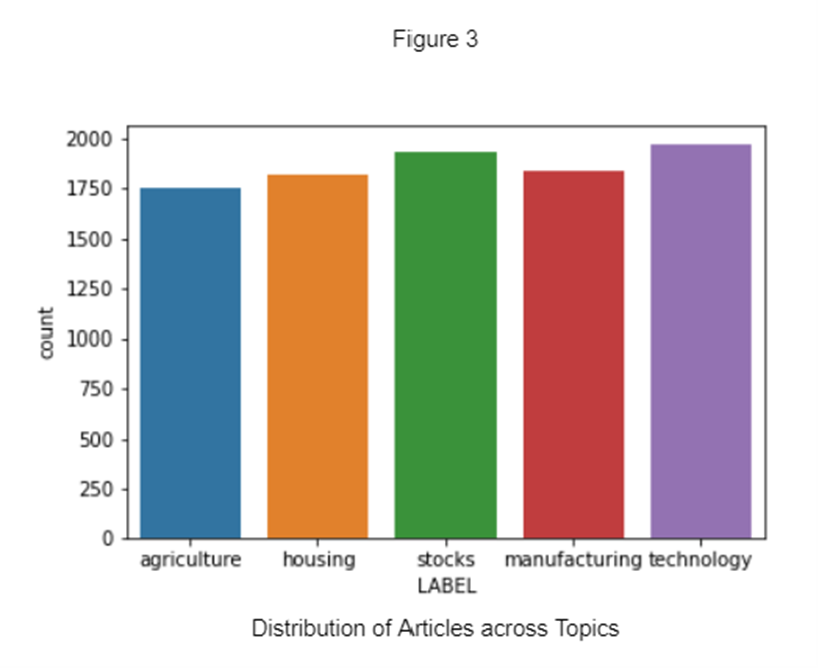

### Sentiment Analysis Data
- **Source**: Kaggle (Financial Sentiment Analysis)
- **Size**: 5,836 sentences (after cleaning)

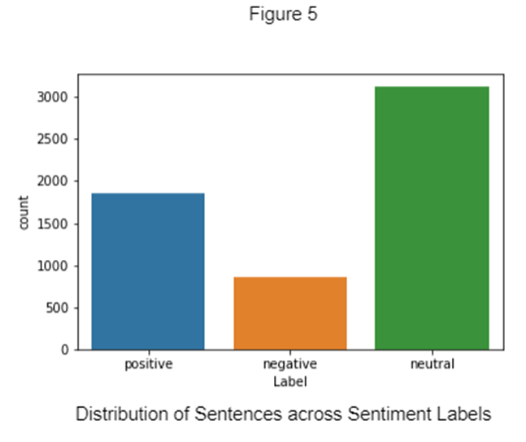

## Data Exloration

Visualizations of the data reveal important insights:

- **Word Clouds**:
  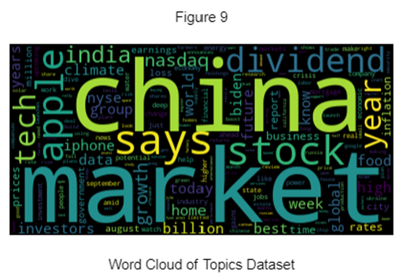
  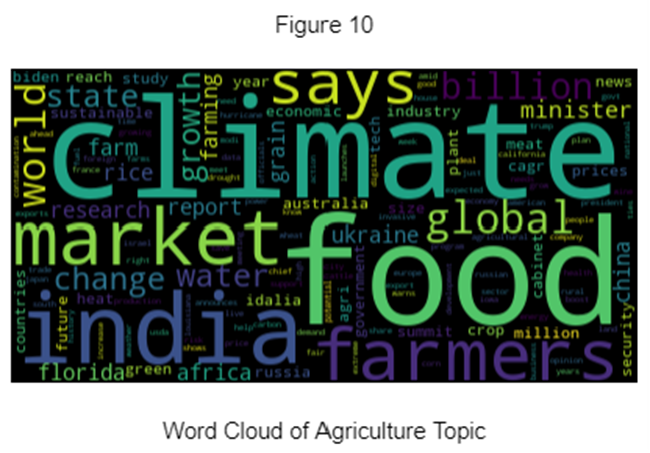
  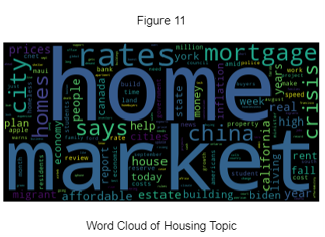
  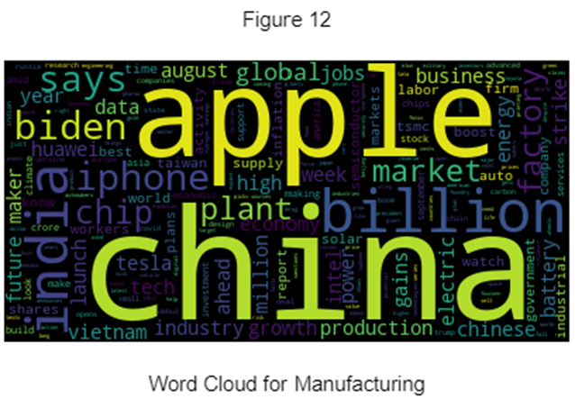
  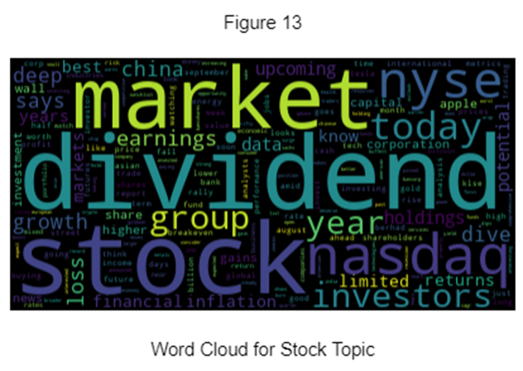
  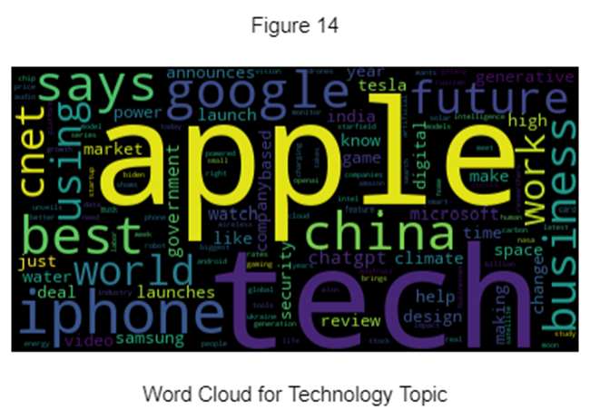

## Data Preprocessing

### Vectorization
Vectorization converts text data into numerical format for analysis. This project uses two methods:
- **CountVectorizer**: Frequency count of each word
- **TfidfVectorizer**: Term frequency-inverse document frequency

#### Vectorization for Topic Analysis
- Parameters: Lowercase conversion, max features set to 1500, removal of English stop words and topic words.

#### Vectorization for Sentiment Analysis
- Parameters: Lowercase conversion, max features set to 1500, removal of English stop words.

## Topic Classification

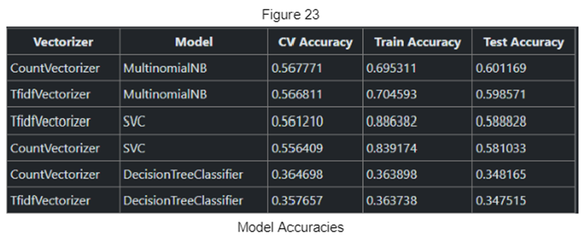

### Naïve Bayes
Naïve Bayes uses Bayes' theorem to classify text data based on word frequencies.
- **Best precision**: Stocks (74%)
- **Best recall**: Stocks (76%)

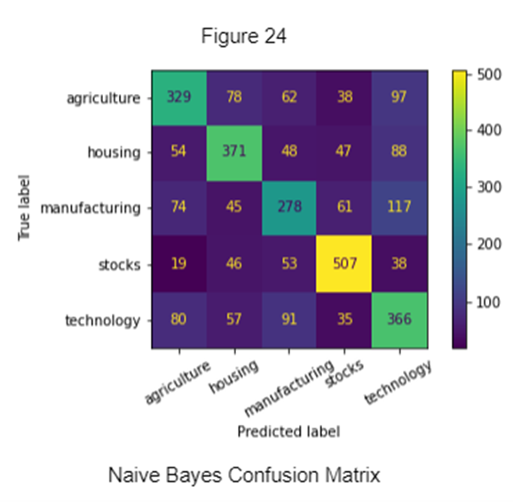

The Naive Bayes model also returned log probabilities of each word for each label. The table below shows the top 10 most important words in each topic for the prediction. 

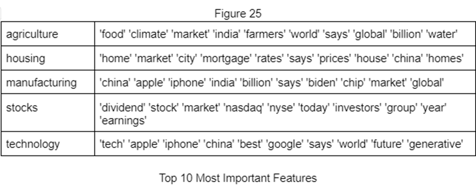

### Latent Dirichlet Allocation (LDA)
LDA uses Bayesian probabilities to discover hidden topics in text data.
- **Number of topics**: 5 distinct groups
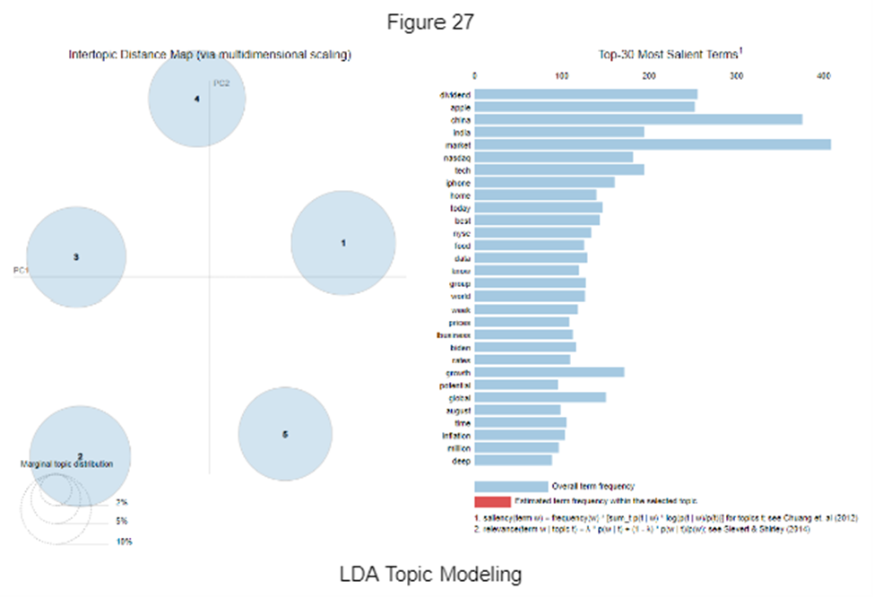

## Sentiment Analysis Models

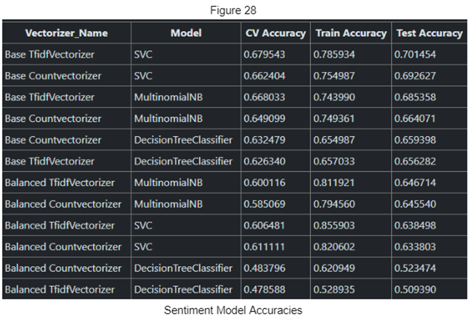

### Support Vector Machine
SVM finds a hyperplane that separates data into different classes.

#### Sentiment Classification: SVM
- **Best precision (unbalanced)**: Neutral (72%)
- **Best recall (unbalanced)**: Neutral (90%)
- **Best precision (balanced)**: Negative (63%)
- **Best recall (balanced)**: Negative (67%)
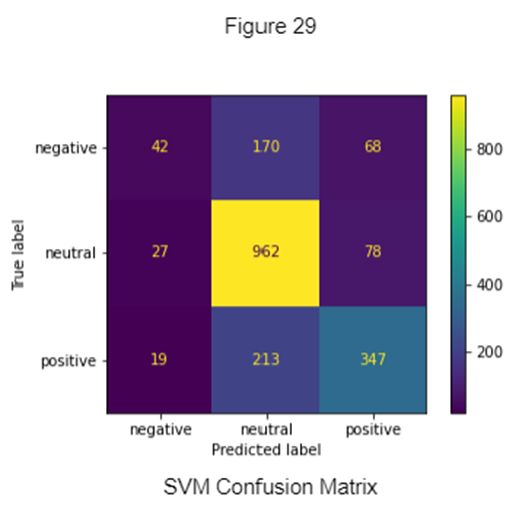

#### Sentiment Predictions by Topic
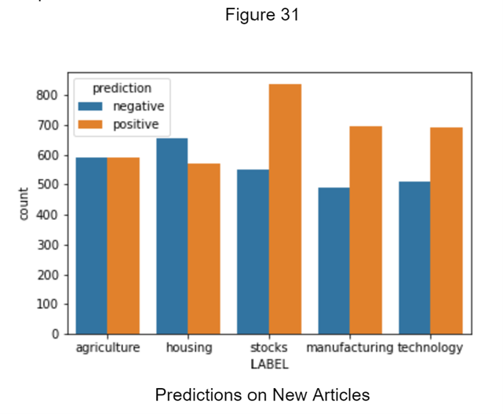

## Conclusion
Traders on Wall Street continuously strive to anticipate changes in stock prices. While traditional financial forecasting methods based on historical performance are useful, they often fail to account for significant unfolding events that can drastically alter economic trajectories. To bridge this gap, investors rely on news to gauge market sentiment and identify emerging trends. Financial firms employ analysts to implement sophisticated systems that can process and analyze news data. This process begins with topic classification, where news articles are categorized by subject matter, followed by sentiment analysis, which determines whether the content is positive, negative, or neutral.

The project aimed to develop a system for topic classification and sentiment analysis of financial news. The topic classifier achieved a 60% accuracy rate, which, despite some overlap among topics, is a promising result given the complexity of the task. Importantly, the classifier showed no significant bias towards any single topic. The sentiment classifier reached a 64% accuracy rate, effectively balancing between predicting positive, negative, and neutral sentiments. While another model exhibited higher overall accuracy, it failed to adequately predict negative sentiments, reducing its practical utility. With further improvements to accuracy, these models can lay the groundwork for a comprehensive system that can integrate news sentiment analysis with traditional financial data to enhance stock price predictions.

## Requirements

- Python 3.10.11
- Scikit-Learn
- Pandas
- Numpy

## Usage

1. Clone the repository:

```
git clone <repository-url>
```

2. Navigate to the project directory:

```
cd financial-news-sentiment
```

3. Install requirements

```
pip install -r requirements.txt
```

4. Run the topic classification:

```
python src/topic-classification.py
```

5. Run the sentiment analysis:

```
python src/sentiment-analysis.py
```

## References
- Weiss, S. M., Indurkhya, N., & Zhang, T. (2015). Fundamentals of Predictive Text Mining.
- Blei, D. M., Ng, A. Y., & Jordan, M. I. (2003). Latent Dirichlet Allocation.
- Ohana, B., & Tierney, B. (2009). Sentiment Classification of Reviews using SVMs and LSA.

For more details, please refer to the `docs/analysis-report.docx`.